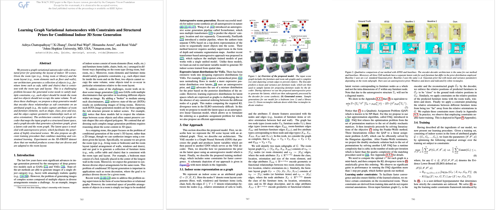

# FLR_GNN

## Overview
FLR_GNN is a Python implementation of my paper, *["Learning Graph Variational Autoencoders with Constraints and Structured Priors for Conditional Indoor 3D Scene Generation"](https://openaccess.thecvf.com/content/WACV2023/papers/Chattopadhyay_Learning_Graph_Variational_Autoencoders_With_Constraints_and_Structured_Priors_for_WACV_2023_paper.pdf),* published in the Proceedings of the IEEE/CVF Winter Conference on Applications of Computer Vision (WACV) 2023. This project implements a graph variational autoencoder (VAE) with constraints and structured priors to generate conditional indoor 3D scenes, leveraging graph neural networks (GNNs) for structured scene representation and generation.

## Preview


## Features
- **Graph Variational Autoencoder**: Models indoor 3D scenes using a graph-based VAE with structured priors.
- **Conditional Scene Generation**: Generates 3D scenes conditioned on specific constraints (e.g., room type, object placement).
- **Graph Neural Networks**: Utilizes GNNs to encode and decode scene graphs for robust representation.
- **Visualization Tools**: Supports visualization of generated 3D scenes and scene graphs.

## Installation
1. Clone the repository:
   ```bash
   git clone https://github.com/xzhang311/FLR_GNN.git
   ```
2. Navigate to the project directory:
   ```bash
   cd FLR_GNN
   ```
3. Install dependencies:
   ```bash
   pip install -r requirements.txt
   ```

## Usage
Run the main script to train the model or generate 3D scenes:
```bash
python main.py --dataset path/to/scene_dataset --output path/to/results --condition room_type
```
Use the `--help` flag for detailed configuration options, including model parameters and generation settings:
```bash
python main.py --help
```

## Requirements
- Python 3.8+
- Libraries: PyTorch, PyTorch Geometric, NumPy, Matplotlib (listed in `requirements.txt`)

## Reference
This project implements the methodology described in:
- *["Learning Graph Variational Autoencoders with Constraints and Structured Priors for Conditional Indoor 3D Scene Generation"](https://openaccess.thecvf.com/content/WACV2023/html/Chattopadhyay_Learning_Graph_Variational_Autoencoders_With_Constraints_and_Structured_Priors_WACV_2023_paper.html),* WACV 2023.

### Citation
If you find this work useful, please cite it using the following BibTeX:
```bibtex
@inproceedings{chattopadhyay2023learning,
  title={Learning graph variational autoencoders with constraints and structured priors for conditional indoor 3d scene generation},
  author={Chattopadhyay, Aditya and Zhang, Xi and Wipf, David Paul and Arora, Himanshu and Vidal, Ren{\'e}},
  booktitle={Proceedings of the IEEE/CVF winter conference on applications of computer vision},
  pages={785--794},
  year={2023}
}
```

## Contributing
Contributions are welcome! Please fork the repository, create a feature branch, and submit a pull request with your enhancements.

## License
This project is licensed under the MIT License. See the [LICENSE](LICENSE) file for details.

## Acknowledgments
This work is based on the research presented in the WACV 2023 paper and builds upon open-source graph neural network and 3D scene generation frameworks.
